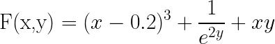

# toygrad

### Acknowledgement
This project is inspired by Andrej Karpathy's micrograd repository and tutorial.

link to his video: https://www.youtube.com/watch?v=VMj-3S1tku0

### Description
This is a toy (but working) auto-gradient engine which is able to build a computational graph of a mathematical expression and executes back-propagation along this graph in the correct order. It uses topological sorting of the computational graph in order to figure out how to run back-propagation correctly.

To keep track of your variables, you need to wrap them up in the `Value` class, which is the main part of this implementation. Then, you can treat your variables as numbers doing whatever operations you want.

## Example: Computing derivatives of complicated function



Here's how you can use this toy engine:

```python
import math
from toygrad import Value

# Define your variables
x = Value(2)
y = Value(0.7)

# Compute your function step by step
step1 = (x - 0.2) ** 3
step2 = y.exp() ** -2
step3 = step1 + step2 + x*y

# Run backpropagation on the last step
step3.backward()

print(f"gradient of x wrt to F is {x.grad}")  # dF/dx = 10.42
print(f"gradient of y wrt to F is {y.grad}")  # dF/dy = 1.506

# Draw the computation graph (if you have implemented the draw_dot function)
draw_dot(step3)
```
## Plans
- add more functions such as log, sin, cos, max, min
- add more activation functions such as relu, sigmoid
- provide a good step-by-step documentation and explanation of code
- Train a Neural Network on real data using this engine
